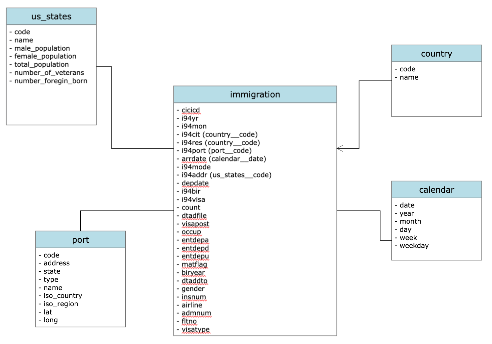

# Data Engineering Capstone Project

## Project Summary

The objective of this project was to create an ETL pipeline for I94 immigration, airports and US demographics datasets to form an analytics database on immigration events. A use case for this analytics database is to find immigration patterns to the US.

## Data and Code

All the data for this project was kept on premise.

The project workspace includes:

- **etl** - python package with ETL required to process all data into DM tables.
- **aws** - python package with AWS abstractions using boto3
- **Capstone_Project.ipynb and EDA.ipynb** - jupyter notebooks used in project submission and for exploratory data analysis (EDA).

### The pipeline has the following steps:

- Data is moved from raw to stagging directory after cleaning and validation
- Tables are created and stored in tables directory

[](data_model.png)


## Step 4: Run Pipelines to Model the Data

```bash
python -m etl.stagging
python -m etl.tables
```
